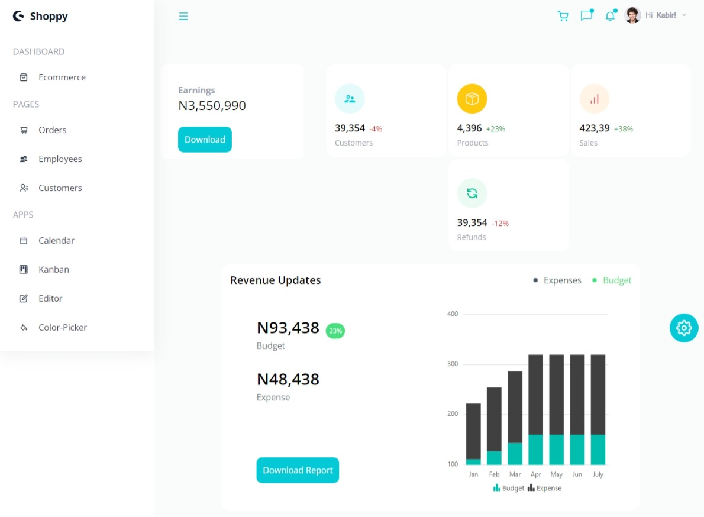
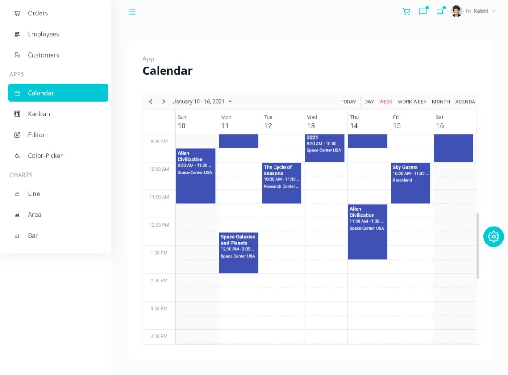
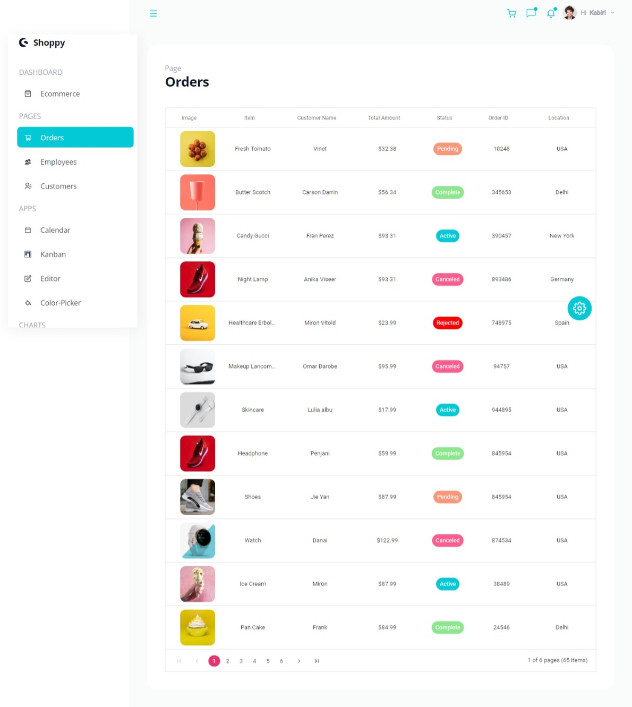
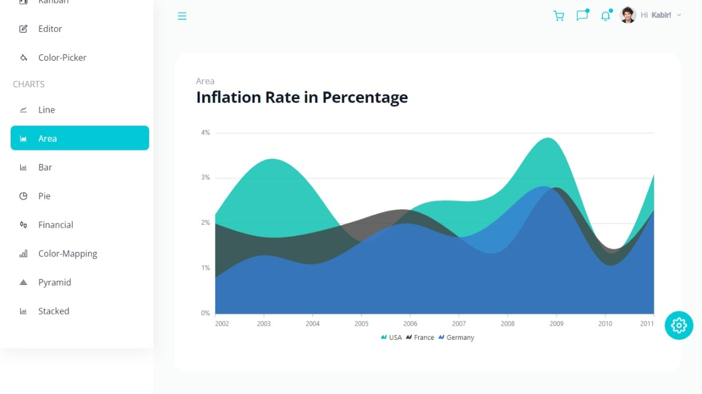
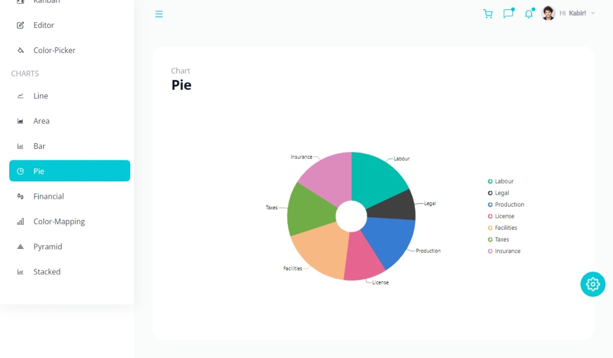

# Admin Dashboard

## Table of Contents

- [About](#about)
- [Components](#components)
- [App.js](#appjs)
- [Navbar](#navbar)
- [Pages](#pages)
- [Apps](#apps)
- [Charts](#charts)
- [Mode and Themes](#mode-and-themes)
- [Sidebar](#sidebar)
- [Global context](#global-context)
- [Resources](#resources)
- [Note](#note)
- [Screenshots](#screenshots)
- [Acknowledgement](#acknowledgement)
- [Live link](#live-link)

## About

- This is a dashboard built using React JS. it exhibits the power of using third party components. The third party library used for this project is Syncfusion. Syncfusion posseses already built components that are ready to use as long as the the right dependencies are used in the appropriate way. To find out more, visit the documenatation link attached in the resources section.

## Components

- The components folder housed reusable react components which were created to be used in this project. The components included a button, header, footer, Navbar, ThemeSettings, Profile, Notifications, ChartsHeader, sidebar etc. Prop drilling was used to determine the properties of the button component on every page which the button was used. React icons were imported and used in each of these components.

## App.js

- The App.js file contains the geenral layout for this project. All components including the sidebar, themesettings, Main section, navbar, header were rendered on this component. React router was imported from react-router-dom and used to navigate between different views. All paths were wrapped in a BrowserRouter component. The entire look of this component was rendered based on conditions specified such as the current theme, current mode, theme settings and the state of the menu bar (active or not).

### Navbar

- The major components of the navbar were created using the Navbutton. The icon was populated by icons imported from react-icons.
- Each button was assigned props such as color, dotcolor and a custom function.
- Tooltip component was imported from syncfusion.
- Tooltip component was used to display the tooltip on hover.
- Each component is rendered conditionally depending on if the button is clicked by using the '&&' operator. Thus, whenever any of the buttons is clicked, the designated component will be rendered.

### Pages

- The pages created included a Calendar page, a color picker page, Customers page, Ecommerce Page, Editor, Employees, Kanban and orders page.

- The Customers Page was built by importing the gridComponent, columnsDIrective, columnDirective as well as other services such as filter, edit, sort, page, selection and toolbar from syncfusion. The data created was mapped over in a columsdirective and for each item in the data array a columnDirective was created with the above services injected and customized.
- The Ecommerce page renders a series of divs displaying different data such as budget, earnings, expenses etc. Icons were imported from react icons and styled. A sparkline component was also component was also added.
- The employees page was built by importing the gridComponent, columnsDIrective, columnDirective as well as other services such as page, search and toolbar from syncfusion. The data created was mapped over in a columsdirective and for each item in the data array a columnDirective was created with the above services injected and customized.
- The orders page was built by importing the gridComponent, columnsDIrective, columnDirective as well as other services such as resize, page, sort, Filter, page, excelExport, pdfExport and Edit from syncfusion. The data created was mapped over in a columsdirective and for each item in the data array a columnDirective was created with the above services injected and customized.
- All data used for each component were imported from a js file which contained arranged dummy data.

### Apps

- The Calendar app was built by importing the 'ScheduleComponent' from syncfusion as well as other components such as day, week, workweek, month, agenda, draganddrop. These were services and they were applied to the scheduleComponent using the 'inject' function which was also imported from syncfusion.
- The color picker app was built by importing the colorPickerComponent from syncfusion. This component had properties specified such as the id, mode, showButtons, modeSwitcher and change properties.
- The Kanban app was built by importing the KanbanComponent, the columnsDirective and ColumnDirective from syncfusion.
- The editor app was created by importing the richTextEditorComponent from syncfusion and adding other services such as image,link, quicktoolbar, toolbar and htmlEditor.

### Charts

- The Charts built included an Area Chart, barChart, LineChart, pie, fiancial, pyramid and stacked chart.
- Each of the charts were built following the specifications from the syncfusion documentations.
- The data used to populate the charts were imported from a js file which contained arranged dummy data.

### Mode and Themes

### Sidebar

- Icons were imported from React-icons
- Link and NavLink were imported from React-router DOM. Tooltip component was imported from Syncfusion popups.
- The sidebar component was built by rendering a div whose height was the entire viewport height, and the width of the div encapsulating it was 18rem.

- For the heading, The Shopware Icon was used and a span containing the text was placed alongside. In the same div, a button was created and the content of the button was the cancel icon
- Next was the main contents which was separated from the header with a margin top of 10. The Items in the main section were achieved by looping through an array (links) and and rendering details from each item.
- The links array was created in a separate data file and imported at the top. It is an array of pre-populated objects.
- For each item returned, the item title property is displayed. Under each of these, another loop is eexecuted. The purpose of this loop is to go through each of the returned items properties to the links property (which is an object) and return the values from each links.
- So underneath every Item, the links under them are created. The details of the links shown are the link names and Icons. The icons are imported into the data file from react icons so they are rendered in the sidebar as components on their own.
- Stylings were applied to the the components using tailwind css. Variables were created and the values assigned to these variables were tailwind css styles stored in strings. That way, styles can be rendered conditionally by rendering each variable conditionally. This is especially seen for the navlinks.

### Global Context

- The Global context was used to create variables that we wanted to be accessible to different components we were building.
- This was done by creating a context provider file. In this file the createContext hook and useContext hook were imported.
- The state for activeMenu, currentColor, isClicked, currentMode, themeSettings were created using the useState hook.
- This component returned a statContext.provider hook which takes in values such as the states created in this file and others.
- The component was exxported and as such any other component that needs to use a state from this provider, just needs to import the useStateContext and create the needed states by calling the useStateContext(). That way the state has access to the state that the useStateContext is providing.

## Resources

- [Syncfusion Documentation](https://ej2.syncfusion.com/react/documentation)

## Note

- It is recommeded in the syncfusion docs to use a class based component when building a sparkline component as opposed to a functional component.

## Screenshots
- 
- 
- 
- 
- 

## Acknowledgement
- [Javascript Mastery course on Youtube](https://www.youtube.com/watch?v=jx5hdo50a2M)

## Live Link
- [Dashboard site](https://syncxdashboard.netlify.app/)